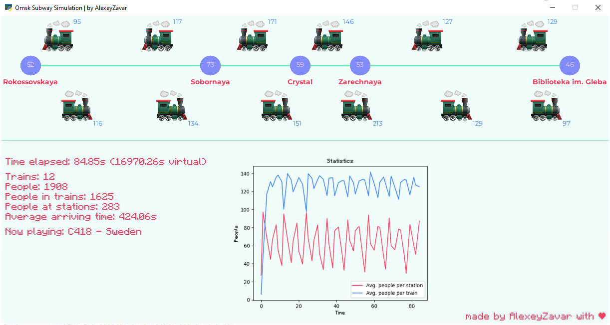

# Omsk subway simulation




## Task

Implement a simulation model of the Omsk subway and calculate the optimal number of trains.

## Features

- Animated GUI (using pygame)
- Change simulation speed (press 1, 2, 3, 4)
- Various train models (F1, F2)
- Minecraft music (F3, F4)

## How to run

```shell
git clone https://github.com/ZavaruKitsu/train_simulation
cd train_simulation

# setup virtual environment
python -m venv venv
pip install -r requirements.txt

# run gui
python main.py
```

## Project structure

> main.py

Entry point.

### src

> consts.py

Just a bunch of constants.

> simulation.py

Simulation by itself.

> visualization.py

Ugly visualization using pygame.

## Credits

- C418 for Minecraft music
- Google Fonts for Montserrat
- Some random site for MinecraftRegular
- Icons8 for `icon.png, train.png, train-old.png`
